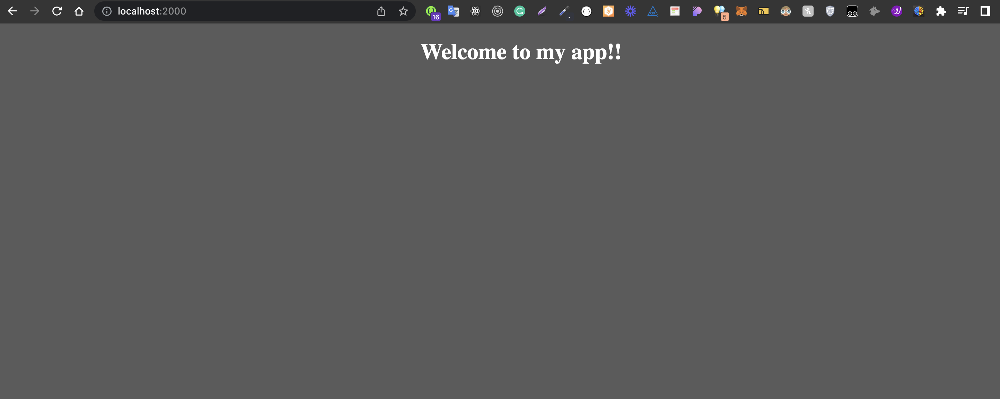
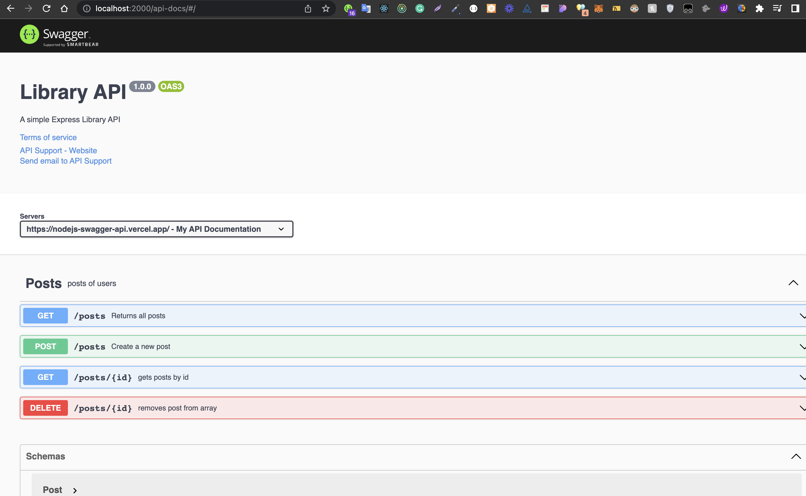

## Follow the steps below to create a RESTful server using swager!

## Here is the Tree

```
 ┣ 📂public
 ┣ 📂src
 ┃ ┣ 📂Data
 ┃ ┃ ┗ 📜data.js
 ┃ ┣ 📂Routes
 ┃ ┃ ┗ 📜posts.js
 ┃ ┣ 📂views
 ┃ ┃ ┣ 📂pages
 ┃ ┃ ┃ ┣ 📜index.css
 ┃ ┃ ┃ ┣ 📜index.ejs
 ┃ ┃ ┃ ┗ 📜log.jpeg
 ┃ ┃ ┣ 📂public
 ┃ ┃ ┃ ┗ 📜index.css
 ┃ ┃ ┗ 📜.DS_Store
 ┃ ┣ 📜.DS_Store
 ┃ ┗ 📜hello.js
 ┣ 📜.DS_Store
 ┣ 📜.babelrc
 ┣ 📜.gitignore
 ┣ 📜Readme.md
 ┣ 📜index.js
 ┣ 📜nodemon.json
 ┣ 📜now.json
 ┣ 📜package-lock.json
 ┣ 📜package.json
 ┗ 📜vercel.json
```

## Firstly let’s create a RESTful web server:

## Navigate the cursor to the file I will create the project in the terminal and I am creating the package.json file with the following command:

```
npm init --y
```

## Now let’s add the packages that are necessary to create the server:

```
npm install express cors morgan body-parser dotenv
```

## let’s add the babel modules to the project:

```
npm install @babel/core @babel/node @babel/preset-env
```

## let’s create the .babelrc file and add the following code:

```
{
  “presets”: [“@babel/preset-env”]
}
```

## And finally, let’s add the following code to scripts field in the package.json file.

```
"start": "nodemon — exec babel-node src/index.js"
```

### If you don’t have nodemon in your PC, I advise installing it globally.

```
sudo npm install -g nodemon
```

## Adding Swagger to the project

Firstly, let’s install two modules that are necessary for documentation and user interface (UI):

```
npm install swagger-jsdoc swagger-ui-express
```

## And I am importing these two modules in the index.js file:

```
import swaggerUI from “swagger-ui-express”;
import swaggerJsDoc from “swagger-jsdoc”;
```

# &#x1F34E; PS: If you have any other ideas about what can be improved please share your thoughts I would really appreciate that!

&nbsp;
&nbsp;

&nbsp;
&nbsp;

## Nodejs server built and maintained by [Milan Sachani &#x1F49C;](https://milansachani.dev)
